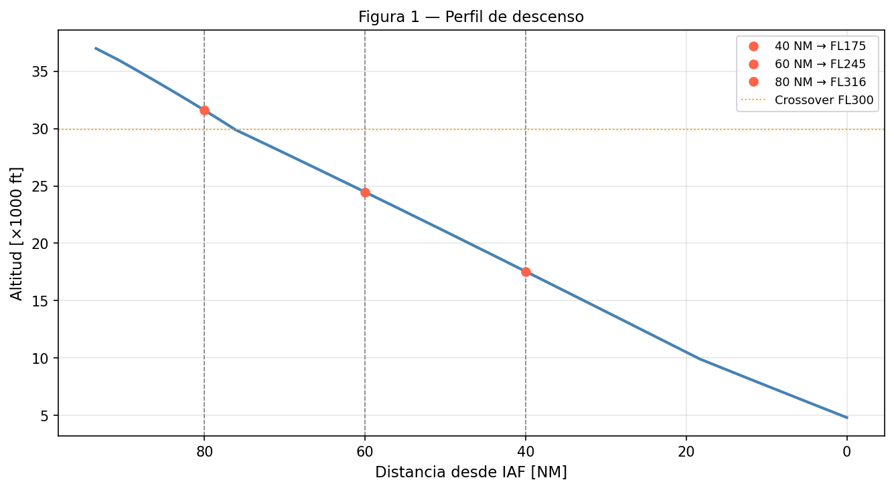
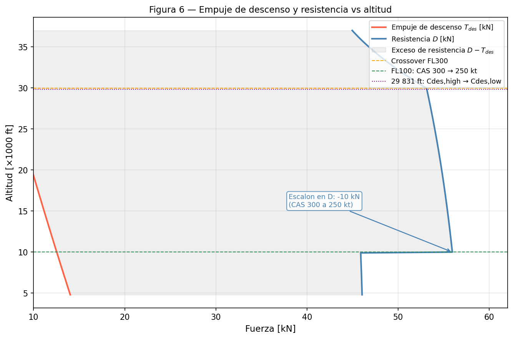
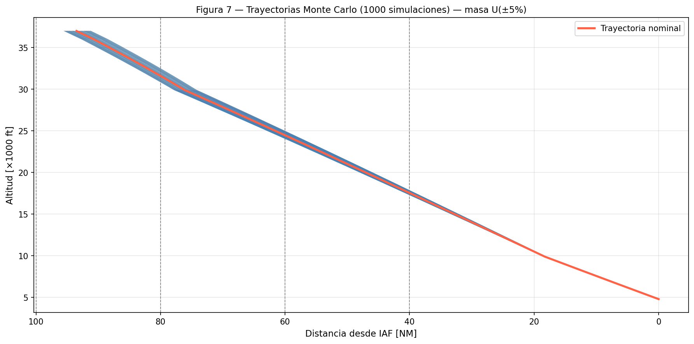

# Predictor de Trayectorias de Descenso — A320 / BADA 

Predictor de trayectorias punto-masa para la fase de descenso de un **Airbus A320-231**, basado en el modelo de rendimiento aeronáutico **BADA 3.9** (Base of Aircraft Data) de EUROCONTROL. Incluye análisis de incertidumbre mediante simulaciones de **Monte Carlo**.

## Caso de estudio

**Vuelo N251SB — Madrid-Barajas (LEMD) → Oslo-Gardermoen (ENGM)**

| Parámetro | Valor |
|---|---|
| Aeronave | Airbus A320-231 / V2500 |
| Altitud de inicio (TOD) | FL370 (37 000 ft) |
| Altitud final (IAF VALPU) | 4 800 ft |
| Masa de referencia (LAW) | 66 123 kg |
| Llegada STAR | RIPAM3L |

## Modelo físico

El predictor integra las ecuaciones del **Total Energy Model (TEM)** con paso de altitud constante, resolviendo en cada nivel el equilibrio entre empuje, resistencia, velocidad y consumo de combustible.

### Fases de velocidad del descenso

1. **Mach constante** (M = 0.79) — por encima de la altitud de crossover (~FL300)
2. **CAS constante 300 kt** — entre crossover y FL100
3. **CAS constante 250 kt** — por debajo de FL100 (restricción ATC)

### Módulos implementados

- **Atmósfera ISA** — temperatura, presión y densidad en troposfera y estratosfera
- **Conversión de velocidades** — CAS ↔ TAS ↔ Mach (formulación compresible)
- **Crossover** — cálculo automático de la altitud de transición Mach/CAS
- **Aerodinámica** — polar parabólica (CD₀ + CD₂·CL²) en configuración limpia
- **Propulsión BADA** — empuje de descenso con doble coeficiente (alta/baja altitud)
- **Energy Share Factor (ESF)** — reparto energético por fase y capa atmosférica
- **Consumo de combustible** — ley lineal de ralentí en descenso
- **Integrador Euler** — marcha temporal con paso Δh = 100 ft

## Resultados

### Trayectoria nominal



El descenso cubre **93.5 NM** en **14.9 minutos**, con un consumo de combustible de 107 kg.

### Empuje y resistencia



### Monte Carlo — Incertidumbre en masa

Se ejecutan **1 000 simulaciones** variando la masa inicial con distribución uniforme U(±5%) sobre la masa de referencia.



## Uso

### Requisitos

```
Python >= 3.8
numpy
matplotlib
scipy
```

### Instalación

```bash
git clone https://github.com/pearpre/bada-trajectory-predictor.git
cd bada-trajectory-predictor
pip install -r requirements.txt
```

### Ejecución

```bash
python descenso_A320_BADA.py
```

El script genera automáticamente en la carpeta `Predictor_outputs/`:

- **8 figuras** (perfil de descenso, TAS, temperatura, CL, ROD, masa/consumo, empuje/resistencia, Monte Carlo)
- **Resultados Monte Carlo** en CSV y MAT (compatible con MATLAB `disttfitter`)
- **Tabla detallada** en consola con el estado de la aeronave nivel a nivel

### Parámetros configurables

Los parámetros principales se encuentran al inicio del script y son fácilmente modificables:

```python
H_INI_FT = 37000.0   # Altitud de inicio del descenso [ft]
H_FIN_FT = 4800.0    # Altitud final [ft]
M_REF_KG = 66123.0   # Masa de referencia [kg]
N_SIM    = 1000      # Número de simulaciones Monte Carlo
INCERT   = 0.05      # Incertidumbre de masa: U(±5%)
DH_FT    = 100.0     # Paso de integración [ft]
```

## Estructura del proyecto

```
bada-trajectory-predictor/
├── descenso_A320_BADA.py       # Script principal
├── requirements.txt
├── LICENSE
├── README.md
├── docs/                       # Figuras para documentación
│   ├── fig1_perfil_descenso.png
│   ├── fig6_THR_D.png
│   └── fig7_mc_trayectorias.png
└── Predictor_outputs/          # Generado automáticamente
    ├── fig1..fig8_*.png
    ├── monte_carlo_resultados.csv
    └── monte_carlo_resultados.mat
```

## Contexto

Proyecto desarrollado en la asignatura de **Predicción, Sincronización y Optimización de Trayectorias** del Máster en Sistemas del Transporte Aéreo, ETSIAE — Universidad Politécnica de Madrid. 
Los coeficientes aerodinámicos y propulsivos corresponden a los ficheros OPF y APF de BADA 3.9 para el A320-231.

## Licencia

[MIT](LICENSE)
